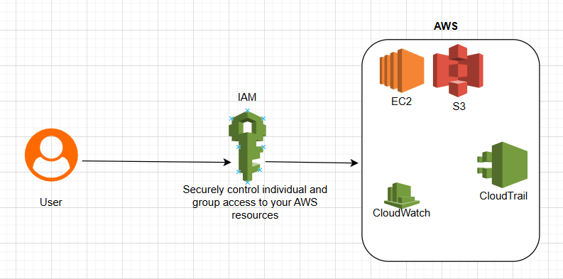

# I - S3 Unsecured Buckets Checker
his Python script scans all S3 buckets in an AWS account and lists those that:

 - Do not have server-side encryption enabled.

 - Do not have a bucket policy applied.

## Features 
 - Scans all S3 buckets in your AWS account.

 - Checks for missing encryption settings.

 - Checks for missing bucket policies.

 - Provides a list of unsecured buckets.

 # II - S3 Bucket Security Enhancer
 This Python script secures all S3 buckets in an AWS account by:

 - Enabling **server-side encryption (AES256)**.

 - Applying a **bucket policy** to enforce HTTPS-only access.

 ### Features
   - Enables AES256 encryption for all buckets.

  - Applies a bucket policy that enforces HTTPS-only access.

 - Uses Boto3 to interact with AWS S3.


 # III - AWS Identity and Access Management (IAM)
 

This project demonstrates the basics of **AWS Identity and Access Management (IAM)** using Python and Boto3. It walks you through how to:

- ✅ Create an IAM group
- ✅ Attach a policy to the group
- ✅ Create an IAM user
- ✅ Add the user to the group



## 📦 Requirements

- Python 3.x
- [Boto3](https://boto3.amazonaws.com/v1/documentation/api/latest/index.html)
- Configured AWS CLI credentials with appropriate IAM permissions

Install Boto3 if you haven't already:

```
pip install boto3
```
# IV - AWS VPC Setup with Boto3
This project automates the setup of a Virtual Private Cloud (VPC) environment in AWS using Python and Boto3. It includes:
- Creation of a VPC, public and private subnets
- Internet and NAT Gateway configuration
- Route tables and security groups
- EC2 instance provisioning in both subnets
## ✅ Result
- Public EC2: Internet accessible
- Private EC2: Internet access via NAT Gateway
- SSH verified on Public EC2
## 🧹 Cleanup
To avoid ongoing charges, make sure to delete:
- EC2 instances
- NAT Gateway
- EIP
- Subnets
- VPC

# V- AWS EC2 Web Server Deployment with Python and Boto3

This project automates the provisioning of an AWS EC2 instance using Python and Boto3. It sets up a virtual private cloud (VPC), a public subnet, security groups, and launches an EC2 instance configured with an Apache web server and a simple HTML web page.

## 📦 Features

- Create a custom VPC and public subnet
- Set up an internet gateway and routing
- Configure a security group for SSH (port 22) and HTTP (port 80)
- Launch an Amazon Linux 2 EC2 instance
- Automatically install Apache HTTP Server
- Serve a basic "Hello from EC2" webpage

## 🛠 Requirements

- Python 3.7+
- Boto3
- AWS CLI configured with sufficient permissions

# VI - Configured Layered of Security for VPC

This project demonstrates how to create a secure and structured AWS Virtual Private Cloud (VPC) using Python and Boto3. It implements key networking components such as subnets, route tables, internet gateways, security groups, network ACLs, and EC2 instances to reflect a layered security architecture.

## 🛠️ Features

- ✅ Create a custom VPC with DNS support
- ✅ Attach an Internet Gateway
- ✅ Set up a public and a private subnet
- ✅ Configure route tables for public and private routing
- ✅ Create and associate Security Groups to control EC2 access
- ✅ Create and associate a Network ACL for subnet-level control
- ✅ Launch two EC2 instances (1 public, 1 private)
- ✅ Public EC2 can be accessed via SSH; private EC2 can be reached from the public instance

## 🖥️ Technologies Used

- Python 3.x
- Boto3 (AWS SDK for Python)
- AWS EC2, VPC, Security Groups, Route Tables, Network ACLs

# VII - AWS Resource Creation with Boto3

This project demonstrates how to create fundamental AWS resources using the Boto3 library for Python. Specifically, it creates:

*   A CloudWatch Log Group
*   A Virtual Private Cloud (VPC)
*   VPC Flow Logs

## Prerequisites

*   Python 3.6 or later
*   Boto3 library installed (`pip install boto3`)
*   Configured AWS credentials (e.g., using `aws configure`)
*   Basic understanding of AWS VPC and CloudWatch Logs


